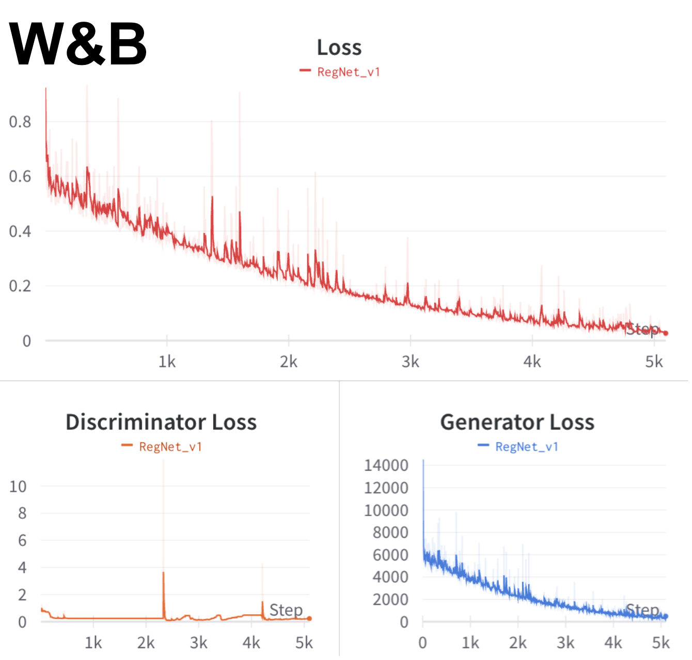
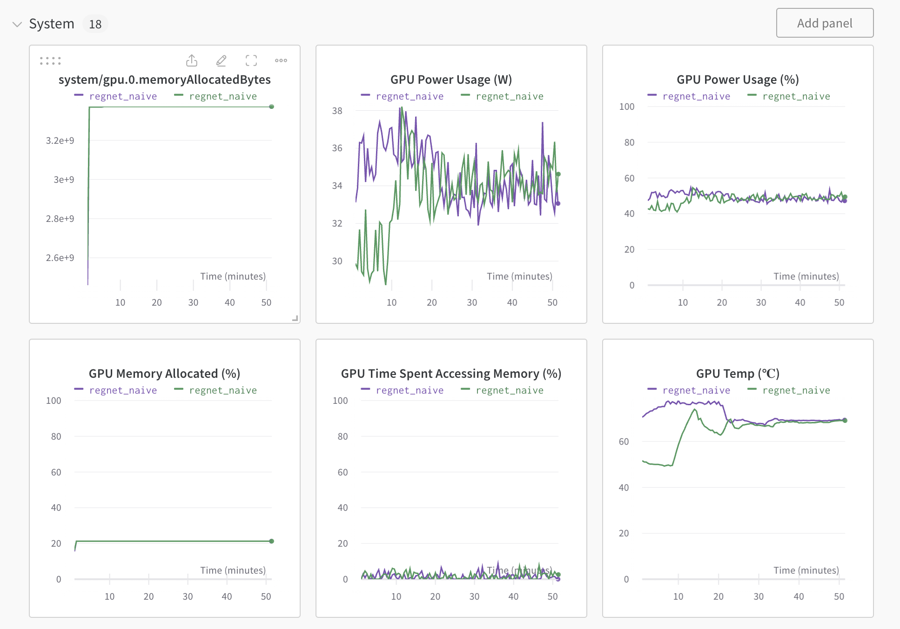
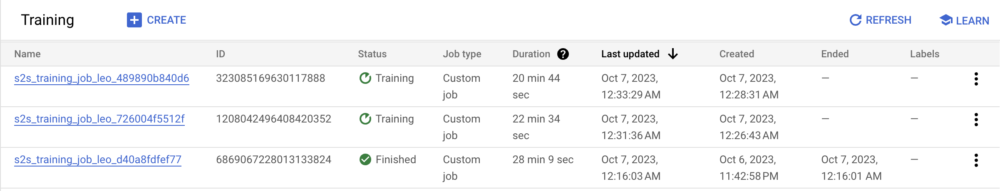

Silent to Sound: Video Sound Generator
==============================

AC215 - Milestone3

Project Organization
------------
      ├── LICENSE
      ├── README.md
      ├── notebooks
      ├── references
      ├── requirements.txt
      ├── setup.py
      └── src
            ├── secrets
            ├── data_collection
            │   ├── ...
            │   ├── collect.py
            │   └── collect_mp.py          <- multi-processing
            ├── preprocessing
            │   ├── ...
            │   └── preprocess.py
            ├── data_representation
            │   ├── Dockerfile
            │   ├── ...
            │   └── data_preprocess.sh
            ├── feature_extraction
            │   ├── Dockerfile
            │   ├── ...
            │   └── feature_extract.sh
            └── train
                ├── Dockerfile
                ├── ...
                ├── package-trainer.sh
                ├── cli.sh
                └── package
                    ├── trainer            <- source code of regnet
                    ├── PKG-INFO
                    └── setup.py
                


**GCP Bucket** 
`s2s_data`
```
  ├── vggsound.csv
  ├── raw_data                <- raw data scraped from youtube
  ├── processed_data          <- intermediate preprocessed data
  ├── filelists               <- splited train and test sets
  ├── features                <- extracted features from preprocessed data
  │   └── processed_data
  │       ├── feature_flow_bninception_dim1024_21.5fps
  │       ├── feature_rgb_bninception_dim1024_21.5fps
  │       └── melspec_10s_22050hz          <- audio feature
  ├── ckpt
  └── dvc_store
```


--------
# AC215 - Milestone3 - Silent to Sound

**Team Members**
Yuqin (Bailey) Bai, Danning (Danni) Lai, Tiantong Li, Yujan Ting, Yong Zhang, and Hanlin Zhu

**Group Name**
S2S (*Silent to Sound*)

**Project**

We aim to develop an application that generates ambient sounds from images or silent videos leveraging computer vision and multimodal models. Our goal is to enrich the general user experience by creating a harmonized visual-audio ecosystem, and facilitate immersive multimedia interactions for individuals with visual impairments.


## Milestone3

### Data representation container
This container is used for extracting Mel-spectrogram from audio, RGB feature, and optical flow features from the data.
To run this - 
* `sh docker-shell.sh` to enter the environment.
* Download data from bucket using `python download_data.py`.
* `source data_preprocess.sh` to run all partial feature extractions and save in local `data/features` folder.
* `upload_partial_feature.py` to upload the partial extracted_features back to GCP bucket for usage in `feature-extraction` container.

### Feature extraction container
We put the second part of the feature extraction into this container so as to avoid conflicts in package dependencies.
To run this - 
* `sh docker-shell.sh` to enter the environment.
* Download some data to `data` folder with  `python download_partial_feature.py`
* `source feature_extract.sh` to extract deeper features from data and save in local `data/features` folder.
* `upload_feature.py` to upload the full extracted_features back to GCP bucket for future usage.

Note: `gen_list.py` is used for train/test split.

### Training container
This container is created for modeling training using Vertext.AI. 

**Experiment Tracking**

Below you can see the output from our Weights & Biases page. We used this tool to track several iterations of our model training. It was tracked using the `wandb` library we included inside of our `src/train/cli.sh` script.




**Serverless Training**

Inside our training container, we used the Google Cloud SDK to launch training instances in the cloud. In the image below, you can see several runs of our model.



To create a new serverless job we did the following commands - 

* First, run container with `sh docker-shell.sh`.
```shell
/app$ sh package-trainer.sh
/app$ sh cli.sh
/app$ exit
```


### Docker cleanup
To make sure we do not have any running containers and clear up unused images -
* Run `docker container ls`
* Stop any container that is running
* Run `docker image ls`
* Run `docker system prune`


### Data visualization for sanity check
- [Colab Notebook](https://colab.research.google.com/drive/16ipwKR76L_exSH5SqfNyQ7FJUOtNSwla?usp=sharing) - facilitates the retrieval of various versions of our dataset managed by DVC, requiring GCP and GitHub authentication. It offers two functions, `dataset_metrics` and `show_examples`, to efficiently visualize dataset samples and display metrics, serving as sanity check for our data.


### Notebooks

This folder contains code that is not part of container. For example, Jupyter notebooks for EDA and model testing.


### [References](references/README.md)
