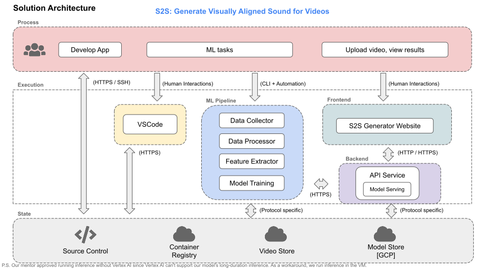
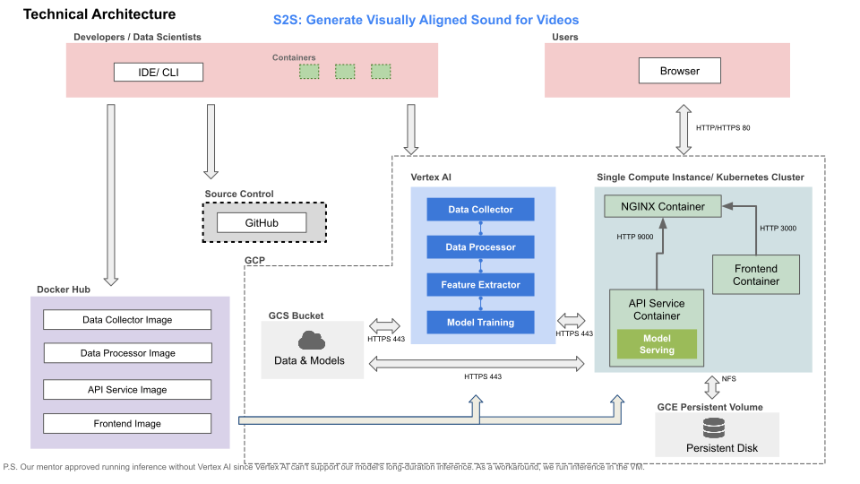
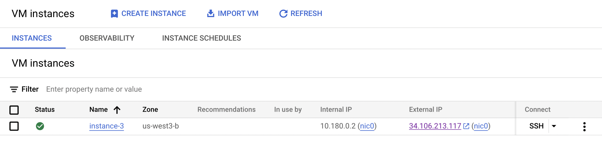
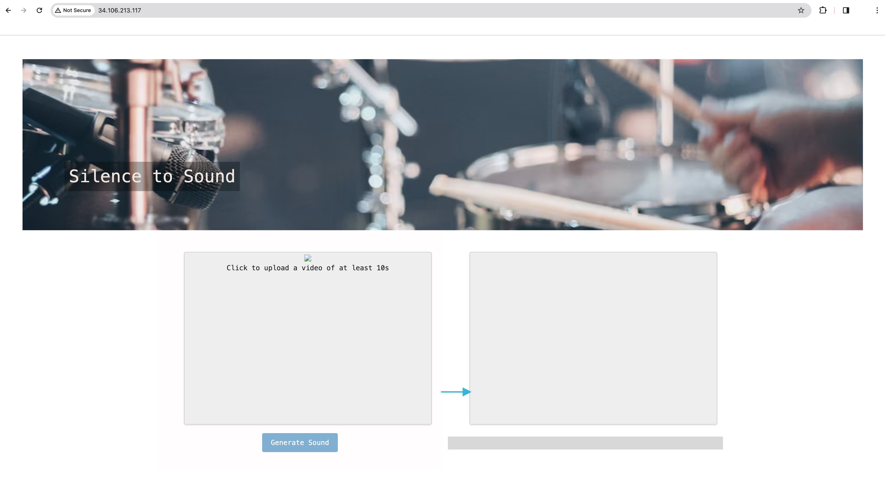
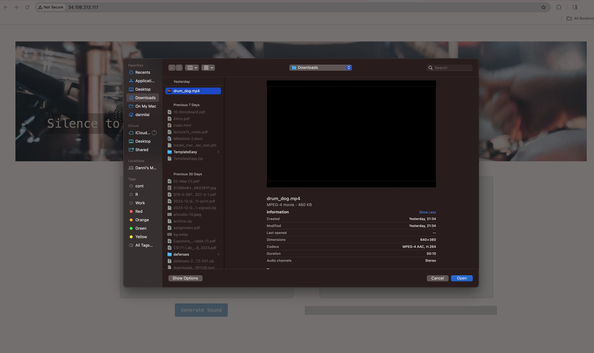
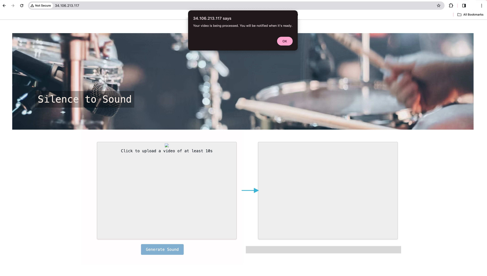
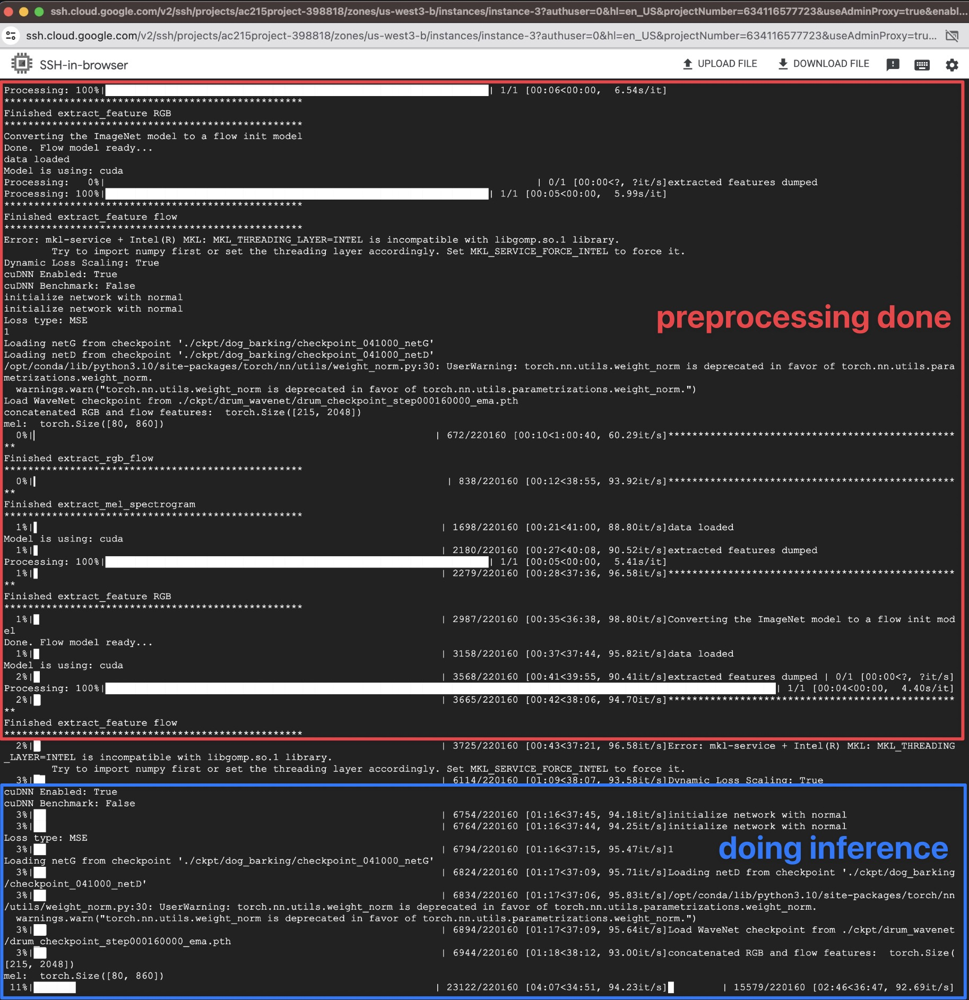
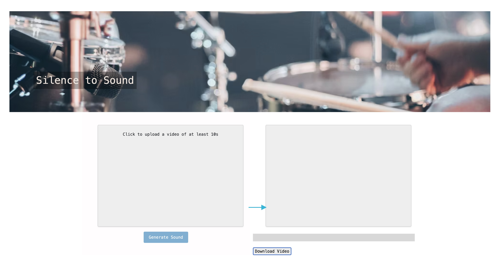

Silence to Sound: Generate Visually Aligned Sound for Videos
==============================

AC215 - Milestone5

Project Organization
------------
      .
      ├── LICENSE
      ├── README.md
      ├── notebooks
      ├── references
      ├── setup.py
      └── src
            ├── secrets
            ├── workflow
            │   └── ...
            ├── data_collection            <- Scripts for dataset creation
            │   └── ...
            ├── data_preprocessing         <- Code for data processing
            │   └── ...
            ├── feature_extraction         <- Code for video feature extracion
            │   └── ...
            ├── train                      <- Model training, evaluation, and prediction code
            │   └── ...
            ├── api_service                <- Code for model deployment & App backend APIs
            │   ├── api
            │   │   ├── tsn
            │   │   ├── wavenet_vododer
            │   │   ├── extract_rgb_flow.py
            │   │   ├── extract_mel_spectrogram.py
            │   │   ├── extract_feature.py
            │   │   ├── model.py
            │   │   ├── api_model.py
            │   │   └── service.py
            │   ├── Dockerfile
            │   ├── docker-entrypoint.sh
            │   ├── docker-shell.sh
            │   ├── Pipfile
            │   └── Pipfile.lock
            └── frontend_simple            <- Code for App frontend
                ├── js
                ├── index.html
                ├── Dockerfile
                └── docker-shell.sh


--------
# AC215 - Milestone5 - Silence to Sound

**Team Members**
Yuqin (Bailey) Bai, Danning (Danni) Lai, Tiantong Li, Yujan Ting, Yong Zhang, and Hanlin Zhu

**Group Name**
S2S (*Silence to Sound*)

**Project**

We aim to develop an application that generates ambient sounds from images or silent videos leveraging computer vision and multimodal models. Our goal is to enrich the general user experience by creating a harmonized visual-audio ecosystem, and facilitate immersive multimedia interactions for individuals with visual impairments.


### Code Structure

The following are the folders from the previous milestones:
```
- data_collection
- data_preprocessing
- feature_extraction
- train
- model_deployment
- workflow
```


## Milestone5

Here is the code structure for this time.

The following are the folders for this milestone:
```
- api_service
- data_collection
- data_preprocessing
- deployment
- feature_extraction
- frontent_simple
- train
- model_deployment
- workflow
```


After completions of building a robust ML Pipeline in our previous milestone we have built a backend api service and frontend app. This will be our user-facing application that ties together the various components built in previous milestones.

**Application Design**

Before we start implementing the app we built a detailed design document outlining the application’s architecture. We built a Solution Architecture abd Technical Architecture to ensure all our components work together.

Here is our Solution Architecture:


Our solution process begins with the Develop App phase where we can interact with the system via HTTPS/SSH protocols, primarily using VSCode as the integrated development environment. The machine learning pipeline consists of four main components: the Data Collector, Data Processor, Feature Extractor, and Model Training modules, which are interconnected and follow a sequential data flow to process and learn from the data effectively.

In our Frontend component, the S2S Generator Website, which allows for video upload and viewing of results by the end-users, facilitated through HTTP/HTTPS protocols. The Backend is supported by an API Service that handles model serving, ensuring efficient communication between the frontend and the machine learning pipeline.

All components are supported by underlying cloud services, including a Source Control system for code management, a Container Registry for Docker images, and a Model Store hosted on Google Cloud Platform (GCP) to store and retrieve our models. 

Here is our Technical Architecture:


Our Technical Architecture is organized to support the application's development and operational needs. For containerization and deployment, images are pulled from Docker Hub, and a Google Cloud Storage (GCS) Bucket is utilized for storing data and models, with secure HTTPS protocol enforced.

We developed four components on Vertex AI, including Data Collector, Data Processor, Feature Extractor, and Model Training, which forms part of the pipeline of our project. The architecture involves an NGINX Container to route traffic, a Frontend Container that serves the user interface, and an API Service Container dedicated to model serving.

Persistent storage is achieved through a Google Compute Engine (GCE) Persistent Volume backed by a Persistent Disk, ensuring data durability and statefulness across sessions. The entire system is designed to ensure seamless integration between development, data handling, and user interaction.

**P.S. Our mentor approved running inference without Vertex AI since Vertex AI can't support our model's long-duration inference. As a workaround, we run inference in the VM.**

### App backend API container

We built backend api service using FAST API to expose model functionality to the frontend. We provide the following functions for listening to the front-end. Some user-friendly prompts are also returned to the user while the model is doing the inference, such as progress bar.


### App frontend container

We built a user friendly frontend simple app to generate the sounds from slient videos using convolution-based models from the backend. Using the app a user can upload a short slient video and upload it. The app will generate the sounds for the video and the user can download the generated video. 


### Deployment
Here is our deployed app on a single VM instance with T4 GPU in GCP:


- run api-service container
```shell
sh shell.sh
```

- run frontend container
```shell
sudo docker pull lildanni/s2s-frontend
sudo docker run -d --name frontend -p 3000:80 --network s2s lildanni/s2s-frontend
```

- run NGINX web server
```shell
sudo docker run -d --name nginx -v $(pwd)/conf/nginx/nginx.conf:/etc/nginx/nginx.conf -p 80:80 --network s2s nginx:stable
```

When the user open the website, there will be the function for user to upload a 10s video.



After getting the user's video, the frontend will inform the user of the progress, and the backend api will be called and start preprocessing and inference.



When the audio is successfully generated, there will be a link generated for the user to download the new video with sound.



### Docker cleanup
To make sure we do not have any running containers and clear up unused images -
* Run `docker container ls`
* Stop any container that is running
* Run `docker image ls`
* Run `docker system prune`


### [References](references/README.md)
