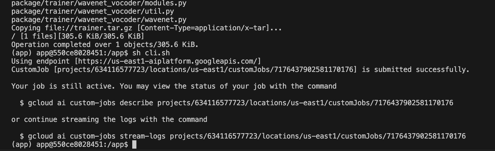

Silence to Sound: Generate Visually Aligned Sound for Videos
==============================

AC215 - Milestone4

Project Organization
------------
      .
      ├── LICENSE
      ├── README.md
      ├── notebooks
      ├── references
      ├── setup.py
      └── ml-workflow/src
            ├── secrets
            ├── workflow
            │   ├── Dockerfile
            │   ├── data_collector.yaml
            │   ├── data_preprocessor.yaml
            │   ├── ...
            │   ├── pipeline.yaml
            │   ├── model.py
            │   └── cli.py
            ├── data_collection
            │   ├── Dockerfile
            │   ├── ...
            │   ├── collect_single.py
            │   └── collect_mp.py          <- multi-processing
            ├── data_preprocessing
            │   ├── Dockerfile
            │   ├── ...
            │   └── preprocess.py
            ├── feature_extraction
            │   ├── Dockerfile
            │   ├── ...
            │   └── feature_extract.sh
            ├── train
            │   ├── Dockerfile
            │   ├── ...
            │   ├── package
            │   │   ├── trainer            <- source code of regnet
            │   │   ├── PKG-INFO
            │   │   └── setup.py
            │   ├── package-trainer.sh
            │   ├── cli.sh
            └── model-deployment
                ├── Dockerfile
                ├── requirments.txt
                ├── ...
                ├── wavenet_vocoder
                ├── model.py
                └── cli.py


**GCP Bucket** 
`s2s_data`
```
  ├── vggsound.csv
  ├── raw_data                <- raw data scraped from youtube
  ├── processed_data          <- intermediate preprocessed data
  ├── features                <- extracted features from preprocessed data
  │   ├── filelists                 <- splited train and test sets
  │   └── playing_bingo
  │       ├── feature_flow_bninception_dim1024_21.5fps
  │       ├── feature_rgb_bninception_dim1024_21.5fps
  │       └── melspec_10s_22050hz          <- audio feature
  ├── dvc_store               <- data registry: yuqinbailey/s2s-dvcrepo
  ├── ckpt
  └── model
```


--------
# AC215 - Milestone4 - Silent to Sound

**Team Members**
Yuqin (Bailey) Bai, Danning (Danni) Lai, Tiantong Li, Yujan Ting, Yong Zhang, and Hanlin Zhu

**Group Name**
S2S (*Silence to Sound*)

**Project**

We aim to develop an application that generates ambient sounds from images or silent videos leveraging computer vision and multimodal models. Our goal is to enrich the general user experience by creating a harmonized visual-audio ecosystem, and facilitate immersive multimedia interactions for individuals with visual impairments.


## Milestone4


```shell
cd ml-workflow/src/workflow
sh docker-shell.sh
python cli.py --pipeline
```

For reference, we have these Docker images on Docker Hub:
`lildanni/data-collection`, 
`lildanni/data-preprocessing`, 
`lildanni/feature-extraction`.

```shell
# Function calls integrated in workflow/cli.py
# equivalent to running the following commands in *corresponding* containers

# run python cli.py --data_colletor
# data_collection
python cli.py —num_workers 2 --target_topic 'playing bongo'

# run python cli.py --data_preprocessor
# data_preprocessing
python cli.py -p playing_bongo -n 10 

# run python cli.py --feature_extractor
# feature_extraction
./feature_extract.sh -p playing_bongo -n 10
```

### Training container
This container is created for modeling training using Vertext.AI. 

**RegNet Model** [<sup>[2]</sup>](references/README.md#2)


**Experiment Tracking**

Below you can see the output from our Weights & Biases page and the loss is decreasing. We used this tool to track several iterations of our model training. It was tracked using the `wandb` library we included inside of our `src/train/cli.sh` script.


**Serverless Training**

Inside our training container, we used the Google Cloud SDK to launch training instances in the cloud. In the image below, you can see several runs of our model.


To create a new serverless job we did the following commands - 

* First, run container with `sh docker-shell.sh`.
* Inside the train container, run
  ```shell
  /app$ sh package-trainer.sh  # generate train.tar.gz
  /app$ sh cli.sh              # submit the job to vertex ai
  ```

  

### Model deployment container

Our Docker uploaded to artifact registry: 

`us-central1-docker.pkg.dev/ac215project-398818/gcf-artifacts/pytorch_predict_regnet`


### Docker cleanup
To make sure we do not have any running containers and clear up unused images -
* Run `docker container ls`
* Stop any container that is running
* Run `docker image ls`
* Run `docker system prune`


### Data visualization for sanity check
- [Colab Notebook](https://colab.research.google.com/drive/16ipwKR76L_exSH5SqfNyQ7FJUOtNSwla?usp=sharing) - facilitates the retrieval of various versions of our dataset managed by DVC, requiring GCP and GitHub authentication. It offers two functions, `dataset_metrics` and `show_examples`, to efficiently visualize dataset samples and display metrics, serving as sanity check for our data.
  - [dataset_v2 sample video](images/dataset_v2_sample.mp4)

### Notebooks

This folder contains code that is not part of container. For example, Jupyter notebooks for EDA and model testing.


### [References](references/README.md)
