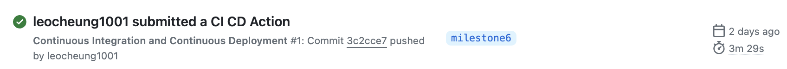

Silence to Sound: Generate Visually Aligned Sound for Videos
==============================

### Presentation  Video
* \<Link Here>

### Blog Post Link
*  https://medium.com/@yuqinbailey/1171a65272c0
---

Project Organization
------------
      .
      ├── LICENSE
      ├── README.md
      ├── references
      ├── setup.py
      └── src
            ├── secrets
            ├── workflow                   <- Kubeflow
            │   └── ...
            ├── data_collection            <- Scripts for dataset creation
            │   └── ...
            ├── data_preprocessing         <- Code for data processing
            │   └── ...
            ├── feature_extraction         <- Code for video feature extracion
            │   └── ...
            ├── train                      <- Model training, evaluation, and prediction code
            │   └── ...
            ├── model_deployment           <- Model deployment using VM
            |   ├── src
            │   │   ├── tsn
            │   │   ├── wavenet_vocoder
            │   │   ├── model.py
            │   │   ├── test.py
            |   |   └── ...
            |   ├── model_sotre
            │   ├── handler.py
            │   ├── docker-shell.sh
            │   ├── config.properties            
            │   └── ...
            ├── api_service                <- Code for App backend APIs
            │   ├── api
            │   │   └── service.py
            │   ├── requirements.txt
            │   ├── Dockerfile
            │   ├── docker-entrypoint.sh
            │   ├── docker-shell.sh
            │   ├── Pipfile
            │   └── Pipfile.lock
            ├── frontend_simple            <- Code for App frontend
            │   ├── conf
            │   ├── css
            │   ├── js
            │   ├── index.html
            │   ├── Dockerfile.dev
            │   ├── Dockerfile
            │   └── docker-shell.sh
            └── deployment                 <- Code for App deployment
                ├── nginx-conf
                ├── inventory.yml
                ├── deploy-create-instance.yml
                ├── deploy-provision-instance.yml
                ├── deploy-docker-images.yml
                ├── deploy-setup-containers.yml
                ├── deploy-setup-webserver.yml
                ├── deploy-k8s-cluster.yml
                ├── Dockerfile
                ├── docker-entrypoint.sh
                └── docker-shell.sh


--------
# AC215 - Final Project

**Team Members**
[Yuqin (Bailey) Bai](https://github.com/yuqinbailey), [Danning (Danni) Lai](https://github.com/dl3918), [Tiantong Li](https://github.com/frankli0731), [Yujan Ting](https://github.com/YujanTing), [Yong Zhang](https://github.com/leocheung1001), and [Hanlin Zhu](https://github.com/hzhu98)

**Group Name**
S2S (*Silence to Sound*)

**Project - Problem Definition**

We aim to develop an application that generates sounds from images or silent videos leveraging computer vision and multimodal models. Our goal is to enrich the general user experience by creating a harmonized visual-audio ecosystem, and facilitate immersive multimedia interactions for individuals with visual impairments.


## Data Description 

We use a public dataset from the Visual Geometry Group at the University of Oxford: VGG-Sound[<sup>[1]</sup>](references/README.md#1) is a large-scale dataset containing 200k+ audio-visual short clips for 300+ types of sound. With each clip approximately 10s long, this is equivalent to 550+ hours of videos. The combination of audio and visual data is highly relevant for multimodal research.


## Proposed Solution

After completions of building a robust ML Pipeline in our previous milestone we have built a backend api service and frontend app. This will be our user-facing application that ties together the various components built in previous milestones.

**S2S App**

We built a user friendly frontend simple app to generate the sounds from slient videos using convolution-based models from the backend. Using the app a user can upload a short slient video and upload it. The app will generate the sounds for the video and the user can download the generated video. 


**Kubernetes Deployment**

We deployed our frontend and backend to a kubernetes cluster to take care of load balancing and failover. We used ansible scripts to manage creating and updating the k8s cluster. Ansible helps us manage infrastructure as code and this is very useful to keep track of our app infrastructure as code in GitHub. It helps use setup deployments in a very automated way.


### Code Structure

The following are the folders from the previous milestones:
```
- data_collection
- data_preprocessing
- feature_extraction
- train
- model_deployment
- workflow
- api_service
- frontend_simple
- deployment
```

### Model Deployment Container

This container deploys our model as an endpoint hosted on a Google Cloud VM using TorchServe. It includes two main components:

1. **src directory**: Houses all the supporting files necessary for the model's operation.
2. **handler.py**: A custom script within the container that orchestrates the model's lifecycle, including data preprocessing, feature extraction, inference, and post-processing.

**Setting Up the Endpoint**  
To set up the endpoint on a VM, follow these steps:

1. **Run the Docker Container**:
   ```
   sudo docker run -it --entrypoint /bin/bash -p 8080:8080 -p 8081:8081 -m 16g --shm-size=8gb --gpus all --sysctl net.ipv4.tcp_keepalive_time=600 --sysctl net.ipv4.tcp_keepalive_intvl=60 --sysctl net.ipv4.tcp_retries2=20 --sysctl net.ipv4.tcp_keepalive_probes=20 hzhu98/my-torchserve-image
   ```

2. **Start TorchServe**:
   ```
   torchserve --start --ncs --model-store model_store --ts-config /workspace/config.properties --models s2s.mar
   ```

**Using the Endpoint**  
To interact with the model via the command line, use the following curl command as an example:
```
curl -X POST http://34.106.213.117:8080/predictions/s2s \
     -H "Content-Type: application/json" \
     -d @input_payload.json
```
In this command, `input_payload.json` should contain a base64-encoded video, formatted as: `[{'file': 'base64_encoded_video_string'}]`.

### App API Service Container

This container has all the python files to run and expose the backend apis.

We built backend api service using FAST API to expose model functionality to the frontend. We provide the following functions for listening to the front-end. Some user-friendly prompts are also returned to the user while the model is doing the inference, such as progress bar.

To run the container locally:

- Open a terminal and go to the location where `/src/- api-service`
- Run `sh docker-shell.sh`
- Once inside the docker container run `uvicorn_server`
- To view and test APIs go to http://localhost:9000/docs


### App Frontend Container

This container contains all the files to develop and build a web app. There are dockerfiles for both development and production. Also, the following directories and file:
 - **conf directory**: Holds configuration for nginx.
 - **css directory**: Holds the formatting/styling file for the JavaScripts.
 - **img directory**: Holds images used by .js and .html.
 - **js directory**: Holds the JavaScript files.
 - **index.html**: The file to open the web interface.


To run the container locally:
- Open a terminal and go to the location where `/src/frontend_simple`
- Run `sh docker-shell.sh`
- Once inside the docker container run `http-server`
- Go to http://localhost:9000 to access the app locally
- ...```

### Deployment Container (Kubernetes for frontend and api service)
This container helps manage building and deploying all our app containers. The deployment is to GCP and all docker images go to GCR. 

To run the container locally:
- Open a terminal and go to the location where `/src/deployment`
- Run `sh docker-shell.sh`
- Build and Push Docker Containers to GCR (Google Container Registry)
```
ansible-playbook deploy-docker-images.yml -i inventory.yml
```

- Create & Deploy Cluster
```
ansible-playbook deploy-k8s-cluster.yml -i inventory.yml --extra-vars cluster_state=present
```

- View the App
* Copy the `nginx_ingress_ip` from the terminal from the create cluster command
* Go to `http://<YOUR INGRESS IP>.sslip.io`


### Deploy using Ansible Playbooks
This section outlines using Ansible playbooks for efficient automation of API service and Frontend deployment. The process involves the following steps: 
1) Set up GCP service accounts for deployment and write the credentials into an inventory YAML file. 
2) Push API and Frontend images to GCP's container registry (GCR). 
3) Create and provision a VM instance with necessary settings (e.g., pip, curl, Docker). 
4) Pull images from GCR to the instance. 
5) Start the containers and NGINX web server. The above steps are all executed via YAML files. This approach allows for quick and efficient deployment with all necessary requirements, highlighting the effectiveness and speed of Ansible Playbooks.


### CI/CD with GitHub Actions
To integrate our code changes (e.g. model architecture optimization or bug fixes) into the current deployment, we enable GitHub actions to automatically trigger the deployment or the whole machine learning workflow pipeline if necessary. 

To enable continuous integration and continuous deployment with GitHub Actions, we 
1. Set the credentials using deployment.json in GitHub settings.
2. Add ./github/workflows/ci-cd.yml, which is the file to indicate what kind of actions we need to perform upon receiving the commit message.

Below is a successful CI/CD action that we have acted after a commit was pushed to GitHub:




### [References](references/README.md)
