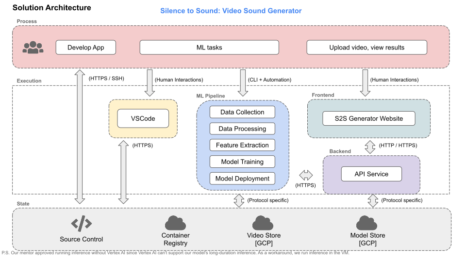

Silence to Sound: Generate Visually Aligned Sound for Videos
==============================

AC215 - Milestone5

Project Organization
------------
      .
      ├── LICENSE
      ├── README.md
      ├── notebooks
      ├── references
      ├── setup.py
      └── src
            ├── secrets
            ├── workflow
            │   └── ...
            ├── data_collection            <- Scripts for dataset creation
            │   └── ...
            ├── data_preprocessing         <- Code for data processing
            │   └── ...
            ├── feature_extraction         <- Code for video feature extracion
            │   └── ...
            ├── train                      <- Model training, evaluation, and prediction code
            │   └── ...
            ├── api_service                <- Code for model deployment & App backend APIs
            │   ├── api
            │   │   ├── tsn
            │   │   ├── wavenet_vododer
            │   │   ├── extract_rgb_flow.py
            │   │   ├── extract_mel_spectrogram.py
            │   │   ├── extract_feature.py
            │   │   ├── model.py
            │   │   ├── api_model.py
            │   │   └── service.py
            │   ├── Dockerfile
            │   ├── docker-entrypoint.sh
            │   ├── docker-shell.sh
            │   ├── Pipfile
            │   └── Pipfile.lock
            └── frontend_simple            <- Code for App frontend
                ├── js
                ├── index.html
                ├── Dockerfile
                └── docker-shell.sh


--------
# AC215 - Milestone5 - Silence to Sound

**Team Members**
Yuqin (Bailey) Bai, Danning (Danni) Lai, Tiantong Li, Yujan Ting, Yong Zhang, and Hanlin Zhu

**Group Name**
S2S (*Silence to Sound*)

**Project**

We aim to develop an application that generates ambient sounds from images or silent videos leveraging computer vision and multimodal models. Our goal is to enrich the general user experience by creating a harmonized visual-audio ecosystem, and facilitate immersive multimedia interactions for individuals with visual impairments.


### Code Structure

The following are the folders from the previous milestones:
```
- data_collection
- data_preprocessing
- feature_extraction
- train
- model_deployment
- workflow
```


## Milestone5
After completions of building a robust ML Pipeline in our previous milestone we have built a backend api service and frontend app. This will be our user-facing application that ties together the various components built in previous milestones.

**Application Design**

Before we start implementing the app we built a detailed design document outlining the application’s architecture. We built a Solution Architecture abd Technical Architecture to ensure all our components work together.

Here is our Solution Architecture:


Here is our Technical Architecture:


### App backend API container
This container has all the python files to run and expose the backend apis.

### App frontend container

### Deployment
- run api-service container
```shell
sh shell.sh
```

- run frontend container
```shell
sudo docker pull lildanni/s2s-frontend
sudo docker run -d --name frontend -p 3000:80 --network s2s lildanni/s2s-frontend
```

- run NGINX web server
```shell
sudo docker run -d --name nginx -v $(pwd)/conf/nginx/nginx.conf:/etc/nginx/nginx.conf -p 80:80 --network s2s nginx:stable
```

When the user open the website, there will be the function for user to upload a 10s video.


After getting the user's video, the backend api will be called and start preprocessing and inference.


When the audio is successfully generated, there will be a link generated for the user to download the new video with sound.


### Docker cleanup
To make sure we do not have any running containers and clear up unused images -
* Run `docker container ls`
* Stop any container that is running
* Run `docker image ls`
* Run `docker system prune`


### [References](references/README.md)
