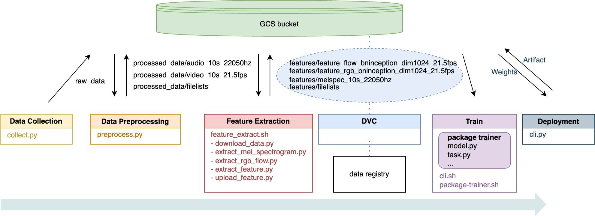

Silence to Sound: Generate Visually Aligned Sound for Videos
==============================

AC215 - Milestone5

Project Organization
------------
      .
      ├── LICENSE
      ├── README.md
      ├── notebooks
      ├── references
      ├── setup.py
      └── src
            ├── secrets
            ├── workflow
            │   ├── Dockerfile
            │   ├── data_collector.yaml
            │   ├── data_preprocessor.yaml
            │   ├── ...
            │   ├── pipeline.yaml
            │   ├── model.py
            │   └── cli.py
            ├── data_collection            <- Scripts for dataset creation
            │   └── ...
            ├── data_preprocessing         <- Code for data processing
            │   └── ...
            ├── feature_extraction         <- Code for video feature extracion
            │   └── ...
            ├── train                      <- Model training, evaluation, and prediction code
            │   ├── package
            │   │   ├── trainer
            │   │   ├── PKG-INFO
            │   │   └── setup.py
            │   └── ...
            ├── model_deployment           <- Model deployment
            │   ├── wavenet_vocoder
            │   └── ...
            ├── api_service                <- Code for App backend APIs
            │   ├── api
            │   ├── Dockerfile
            │   ├── docker-entrypoint.sh
            │   ├── docker-shell.sh
            │   ├── Pipfile
            │   └── Pipfile.lock
            └── frontend_simple            <- Code for App frontend
                ├── js
                ├── index.html
                ├── Dockerfile
                └── docker-shell.sh

**GCP Bucket** 
`s2s_data_new`
```
  ├── vggsound.csv
  ├── raw_data                <- raw data scraped from youtube
  ├── processed_data          <- intermediate preprocessed data
  ├── features                <- extracted features from preprocessed data
  │   ├── filelists                 <- splited train and test sets
  │   └── playing_bingo
  │       ├── feature_flow_bninception_dim1024_21.5fps
  │       ├── feature_rgb_bninception_dim1024_21.5fps
  │       └── melspec_10s_22050hz          <- audio feature
  ├── dvc_store               <- data registry: yuqinbailey/s2s-dvcrepo
  ├── ckpt
  └── model                   <- saved model + update signitures
```


--------
# AC215 - Milestone5 - Silence to Sound

**Team Members**
Yuqin (Bailey) Bai, Danning (Danni) Lai, Tiantong Li, Yujan Ting, Yong Zhang, and Hanlin Zhu

**Group Name**
S2S (*Silence to Sound*)

**Project**

We aim to develop an application that generates ambient sounds from images or silent videos leveraging computer vision and multimodal models. Our goal is to enrich the general user experience by creating a harmonized visual-audio ecosystem, and facilitate immersive multimedia interactions for individuals with visual impairments.


## Milestone5


```shell
cd src/workflow
sh docker-shell.sh
python cli.py --pipeline
```

For reference, we have the calleble Docker images on Docker Hub:
`lildanni/data-collection`, 
`lildanni/data-preprocessing`, 
`lildanni/feature-extraction`.

```shell
# Function calls integrated in workflow/cli.py
# equivalent to running the following commands in *corresponding* containers

# run python cli.py --data_colletor
# data_collection
python cli.py —num_workers 2 --target_topic 'playing bongo'

# run python cli.py --data_preprocessor
# data_preprocessing
python cli.py -p playing_bongo -n 10 

# run python cli.py --feature_extractor
# feature_extraction
./feature_extract.sh -p playing_bongo -n 10

# run pyhon cli.py --model_training
# train
./cli.sh --epochs 1 --batch_size 4 --model_name 'RegNet_v1'

# run python cli.py --model_deploy
# model_deployment
python cli.py --upload
python cli.py --deploy
python cli.py --predict
```

### Kubeflow


**RegNet Model** [<sup>[2]</sup>](references/README.md#2)


### App backend API container


### App frontend container


### Docker cleanup
To make sure we do not have any running containers and clear up unused images -
* Run `docker container ls`
* Stop any container that is running
* Run `docker image ls`
* Run `docker system prune`


### Data visualization for sanity check
- [Colab Notebook](https://colab.research.google.com/drive/16ipwKR76L_exSH5SqfNyQ7FJUOtNSwla?usp=sharing) - facilitates the retrieval of various versions of our dataset managed by DVC, requiring GCP and GitHub authentication. It offers two functions, `dataset_metrics` and `show_examples`, to efficiently visualize dataset samples and display metrics, serving as sanity check for our data.


### [References](references/README.md)
